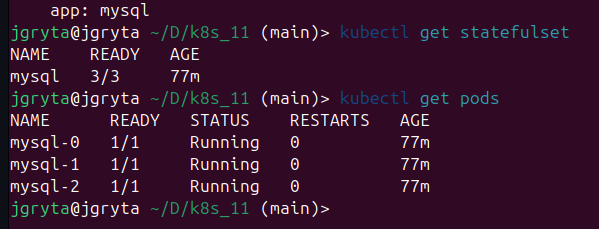
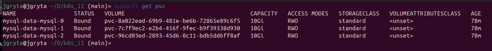
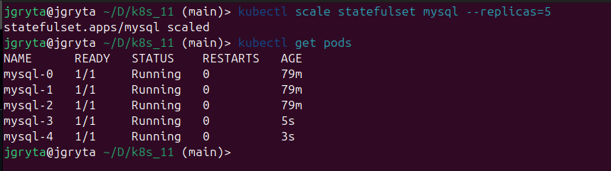

# Task

This repository contains Kubernetes manifests for deploying a MySQL database using a StatefulSet. The example includes scaling up and down.

# StatefulSet vs Deployment

**Key Difference between StatefulSet and Deployment (Scaling Up and Down):**

* **StatefulSet:** Guarantees ordered and predictable scaling.  When scaling *up*, new Pods are created sequentially with increasing ordinal indexes (e.g., `mysql-0`, `mysql-1`, `mysql-2`, etc.).  When scaling *down*, Pods are terminated in reverse order, starting with the highest index.  This ensures data consistency and predictable behavior, critical for stateful applications like databases.

* **Deployment:**  Does not guarantee any specific order during scaling. When scaling *up* or *down*, Pods are created or terminated without a predictable sequence.  This is suitable for stateless applications where the order of instances doesn't matter.  Deployments prioritize speed and availability over ordered operations.  A Deployment might terminate `pod-xyz1` before `pod-abc0` regardless of their creation time.

## Files

- `service.yaml`: Definition of the **mysql** headless service for DNS addressing of Pods.
- `statefulSet.yaml`: StatefulSet configuration for MySQL with persistent data storage.
- `configMap.yaml`: MySQL credentials.

## Prerequisites

1. Kubernetes cluster (Minikube or a cloud-based cluster).
2. `kubectl` tool installed and configured.

## Deployment Steps

1. **Apply manifests:**

   ```bash
   kubectl apply -f statefulSet.yaml
   kubectl apply -f service.yaml
   kubectl apply -f configMap.yaml
   ```

2. **Verify StatefulSet and Pods:**

   ```bash
   kubectl get statefulset
   kubectl get pods
   ```

   

3. **Check Persistent Volumes:**

   ```bash
   kubectl get pvc
   ```

   

## Scaling the StatefulSet

### Scaling Up

Increase the number of replicas:

```bash
kubectl scale statefulset mysql --replicas=5
```

Verify the new Pods:

```bash
kubectl get pods
```



Check data replication and the initialization order of the Pods.  New pods will be initialized sequentially, with increasing ordinal indexes.

### Scaling Down

Decrease the number of replicas:

```bash
kubectl scale statefulset mysql --replicas=2
```

```bash
kubectl get pods
```


StatefulSet ensures that Pods are terminated in reverse order (highest index first).  This is important for data consistency and to avoid potential data loss.

